<h1 align=center>@aresrpg/ui</h1>

<p align=center>
  
</p>

<p align=center>
  
  
  
  
</p>

<p align=center>Glassmorphism Vue 3 component library for modern gaming UIs</p>

<p align=center>
  <a href="https://aresrpg.github.io/aresrpg-ui/" target="_blank">
    <strong>🎮 Live Demo</strong>
  </a>
  &nbsp;•&nbsp;
  <a href="#-installation">Installation</a>
  &nbsp;•&nbsp;
  <a href="#-components">Components</a>
</p>

---

A beautiful, theme-switchable Vue 3 component library featuring glassmorphism effects, animated gradient backgrounds, and a gaming-focused design aesthetic. Try all 5 themes (Dark, White, Blue, Matrix, Neumorphism) in the [live demo](https://aresrpg.github.io/aresrpg-ui/)!

## ✨ Features

- 🎨 **5 Built-in Themes**: Dark (default), White, Blue, Matrix, Neumorphism
- 💎 **True Glassmorphism**: Animated gradient mesh backgrounds with backdrop blur
- ⚡ **Vue 3 + Vite**: Fast, modern, tree-shakeable
- 🎮 **Gaming Aesthetic**: MMORPG-inspired design with angular borders and bold typography
- 📦 **Zero Dependencies**: Only requires Vue 3 as peer dependency
- 🎯 **TypeScript Ready**: Full JSDoc annotations
- 🌐 **SSR Compatible**: Works with Nuxt and other SSR frameworks
- ♿ **Accessible**: WCAG 2.1 AA compliant with proper ARIA labels

## 🖼️ Preview

<p align="center">
  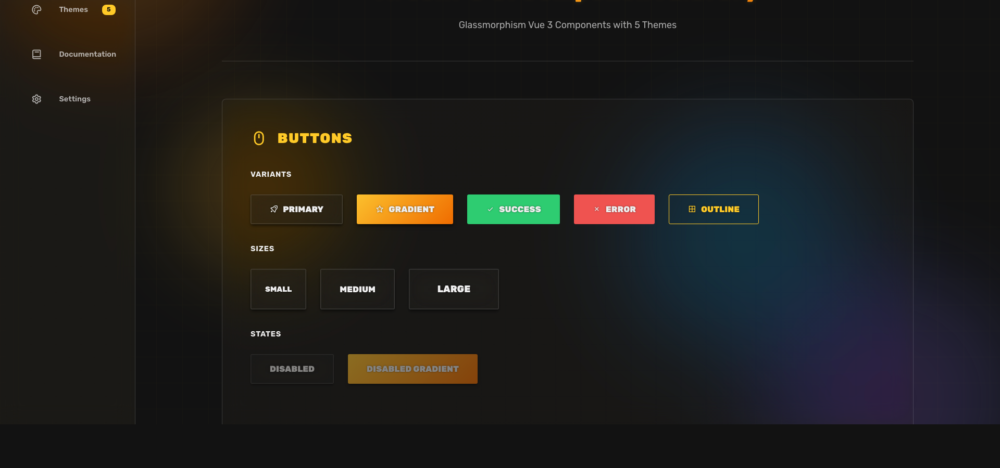
</p>

## 📦 Installation

```bash
npm install @aresrpg/ui
```

## 🚀 Quick Start

### Global Registration

```js
// main.js
import { createApp } from 'vue'
import AresRPGUI from '@aresrpg/ui'
import '@aresrpg/ui/style.css'
import App from './App.vue'

const app = createApp(App)
app.use(AresRPGUI)
app.mount('#app')
```

Now all components are available with `Ares` prefix:

```vue
<template>
  <AresButton variant="gradient">Click me</AresButton>
  <AresCard title="Hello World" />
</template>
```

### Import on Demand (Tree Shaking)

The library is fully tree-shakeable. Named imports only bundle what you use:

```vue
<script setup>
import { Button, Card, ThemeSwitcher } from '@aresrpg/ui'
import '@aresrpg/ui/style.css'
</script>

<template>
  <div>
    <ThemeSwitcher />
    <Button variant="gradient">Click me</Button>
    <Card title="Hello World" />
  </div>
</template>
```

**Bundle Impact**: Each component is 0.5-6 KB (gzipped). Import only what you need:
- `Button`: 0.73 KB
- `Card`: 0.92 KB
- `Notification`: 1.53 KB
- `Sidebar`: 1.64 KB

Full UMD bundle: 50 KB (if you need all components).

## 🎨 Theme System

### Available Themes

- **dark** (default): Gold/Orange accents, MMORPG gaming aesthetic
- **white**: Clean professional look with Blue/Purple accents
- **blue**: Ocean/Cyberpunk theme with Cyan accents
- **matrix**: Terminal/Hacker theme with Green accents
- **neumorphism**: Soft shadows and depth, minimalist design

### Theme Switcher

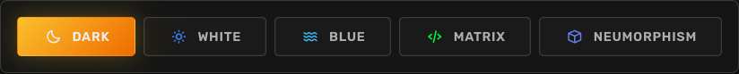

```vue
<script setup>
import { ThemeSwitcher } from '@aresrpg/ui'
</script>

<template>
  <ThemeSwitcher />
</template>
```

### Using Themes Programmatically

```vue
<script setup>
import { useTheme } from '@aresrpg/ui'

const { currentTheme, setTheme, toggleTheme, themes } = useTheme()

// Set specific theme
setTheme('matrix')

// Toggle through themes
toggleTheme()

// Get current theme
console.log(currentTheme.value) // 'matrix'

// Get all available themes
console.log(themes) // ['dark', 'white', 'blue', 'matrix', 'neumorphism']
</script>
```

## 📚 Components

### Button

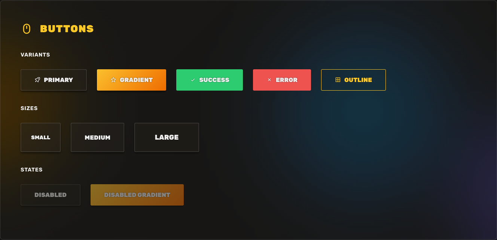

Glassmorphism button with multiple variants, sizes, and states.

```vue
<script setup>
import { Button } from '@aresrpg/ui'
</script>

<template>
  <!-- Variants -->
  <Button variant="primary">Primary</Button>
  <Button variant="gradient">Gradient</Button>
  <Button variant="success">Success</Button>
  <Button variant="error">Error</Button>
  <Button variant="outline">Outline</Button>

  <!-- Sizes -->
  <Button size="sm">Small</Button>
  <Button size="md">Medium</Button>
  <Button size="lg">Large</Button>

  <!-- States -->
  <Button :disabled="true">Disabled</Button>
  <Button :loading="true">Loading</Button>
</template>
```

**Props:**
- `variant`: 'primary' | 'gradient' | 'success' | 'error' | 'outline' (default: 'primary')
- `size`: 'sm' | 'md' | 'lg' (default: 'md')
- `disabled`: boolean (default: false)
- `loading`: boolean (default: false)

**Events:**
- `@click`: Emitted when button is clicked

---

### Card

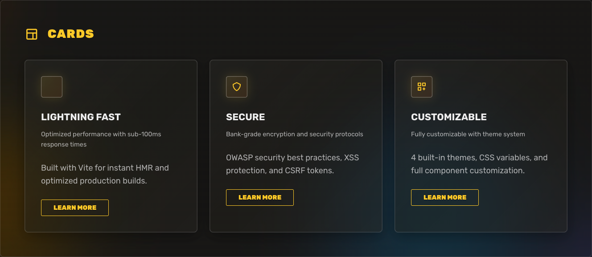

Glassmorphism card with header, icon, and footer slots.

```vue
<script setup>
import { Card, Button } from '@aresrpg/ui'
</script>

<template>
  <Card
    title="Card Title"
    description="Card description"
    icon="bx bx-star"
    :hoverable="true"
  >
    <p>Card content goes here</p>

    <template #footer>
      <Button size="sm">Learn More</Button>
    </template>
  </Card>
</template>
```

**Props:**
- `title`: string - Card title
- `description`: string - Card description
- `icon`: string - Icon class (e.g., 'bx bx-star')
- `hoverable`: boolean (default: true) - Enable hover effect

**Slots:**
- `default`: Card content
- `icon`: Custom icon content
- `title`: Custom title content
- `description`: Custom description content
- `header`: Full custom header
- `footer`: Footer content

---

### Input

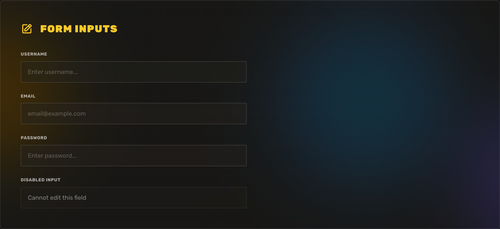

Glassmorphism text input with validation states and icon support.

```vue
<script setup>
import { ref } from 'vue'
import { Input } from '@aresrpg/ui'

const username = ref('')
const email = ref('')
</script>

<template>
  <!-- Basic input -->
  <Input
    v-model="username"
    type="text"
    label="Username"
    placeholder="Enter username..."
  />

  <!-- With validation states -->
  <Input
    v-model="email"
    type="email"
    label="Email"
    :error="true"
    error-message="Invalid email format"
    prefix-icon="bx bx-envelope"
  />

  <!-- Success state -->
  <Input
    v-model="username"
    label="Username"
    :success="true"
    success-message="Username available"
  />

  <!-- With helper text -->
  <Input
    label="Password"
    type="password"
    helper-text="Must be at least 8 characters"
    suffix-icon="bx bx-lock"
  />
</template>
```

**Props:**
- `modelValue`: string | number - v-model binding
- `type`: 'text' | 'email' | 'password' | 'number' (default: 'text')
- `label`: string - Input label
- `placeholder`: string - Placeholder text
- `disabled`: boolean (default: false)
- `error`: boolean (default: false) - Show error state
- `errorMessage`: string - Error message text
- `success`: boolean (default: false) - Show success state
- `successMessage`: string - Success message text
- `helperText`: string - Helper text below input
- `prefixIcon`: string - Icon class for prefix icon
- `suffixIcon`: string - Icon class for suffix icon

**Events:**
- `@update:modelValue`: Emitted when input value changes
- `@focus`: Emitted when input gains focus
- `@blur`: Emitted when input loses focus

---

### Modal

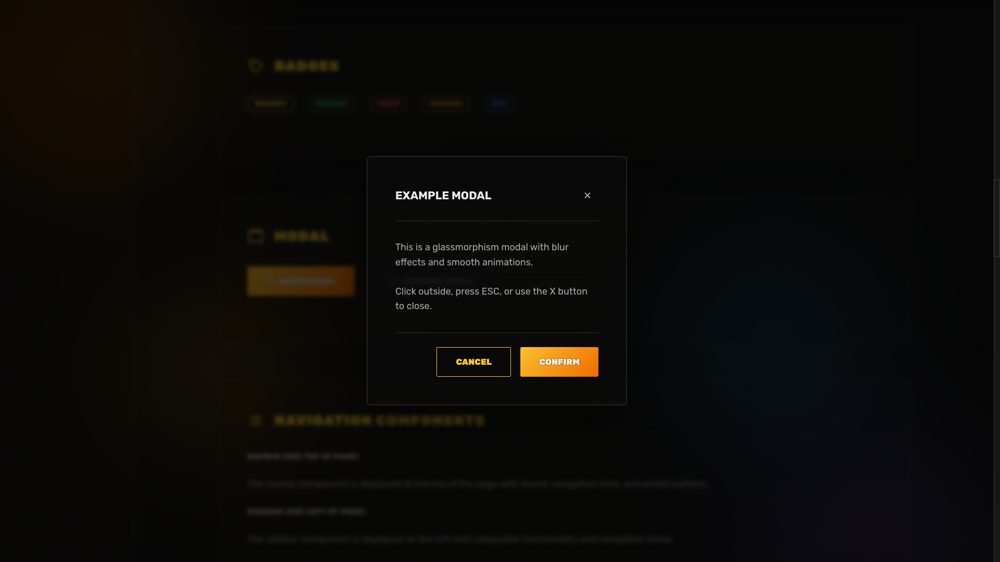

Glassmorphism modal with backdrop blur and multiple size variants.

```vue
<script setup>
import { ref } from 'vue'
import { Modal, Button } from '@aresrpg/ui'

const showModal = ref(false)
</script>

<template>
  <Button @click="showModal = true">Open Modal</Button>

  <Modal
    v-model="showModal"
    title="Modal Title"
    size="md"
    :closable="true"
    :close-on-overlay="true"
  >
    <p>Modal content goes here</p>

    <template #footer>
      <Button @click="showModal = false">Cancel</Button>
      <Button variant="gradient" @click="showModal = false">Confirm</Button>
    </template>
  </Modal>
</template>
```

**Props:**
- `modelValue`: boolean (required) - v-model binding for visibility
- `title`: string - Modal title
- `size`: 'sm' | 'md' | 'lg' | 'xl' | 'full' (default: 'md') - Modal size
- `closable`: boolean (default: true) - Show close button
- `closeOnOverlay`: boolean (default: true) - Close when clicking overlay

**Events:**
- `@update:modelValue`: Emitted when modal visibility changes
- `@close`: Emitted when modal is closed

**Slots:**
- `default`: Modal content
- `header`: Custom header content
- `footer`: Footer content

---

### Badge

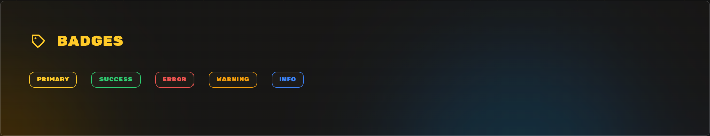

Status badge with color variants.

```vue
<script setup>
import { Badge } from '@aresrpg/ui'
</script>

<template>
  <Badge variant="primary">Primary</Badge>
  <Badge variant="success">Success</Badge>
  <Badge variant="error">Error</Badge>
  <Badge variant="warning">Warning</Badge>
  <Badge variant="info">Info</Badge>
</template>
```

**Props:**
- `variant`: 'primary' | 'success' | 'error' | 'warning' | 'info' (default: 'primary')

---

### Alert

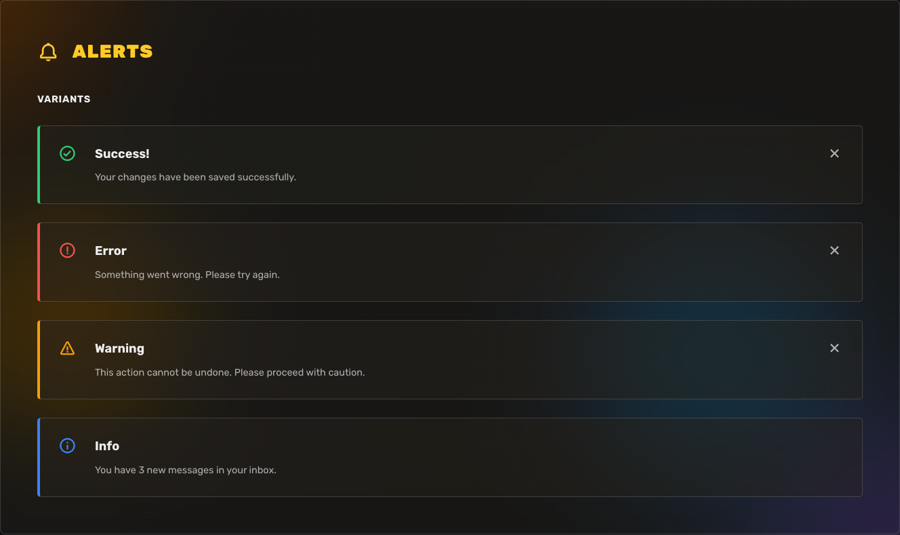

Alert messages with icon and dismissible variants.

```vue
<script setup>
import { ref } from 'vue'
import { Alert } from '@aresrpg/ui'

const showAlert = ref(true)
</script>

<template>
  <Alert
    v-model="showAlert"
    variant="success"
    title="Success!"
    message="Your changes have been saved successfully."
    :dismissible="true"
  />

  <Alert
    variant="error"
    title="Error"
    message="Something went wrong. Please try again."
  />

  <Alert
    variant="warning"
    title="Warning"
    message="This action cannot be undone."
  />

  <Alert
    variant="info"
    title="Info"
    message="You have 3 new messages."
  />
</template>
```

**Props:**
- `modelValue`: boolean - v-model for visibility (optional)
- `variant`: 'success' | 'error' | 'warning' | 'info' (default: 'info')
- `title`: string - Alert title
- `message`: string - Alert message
- `dismissible`: boolean (default: true) - Show dismiss button

---

### Toggle

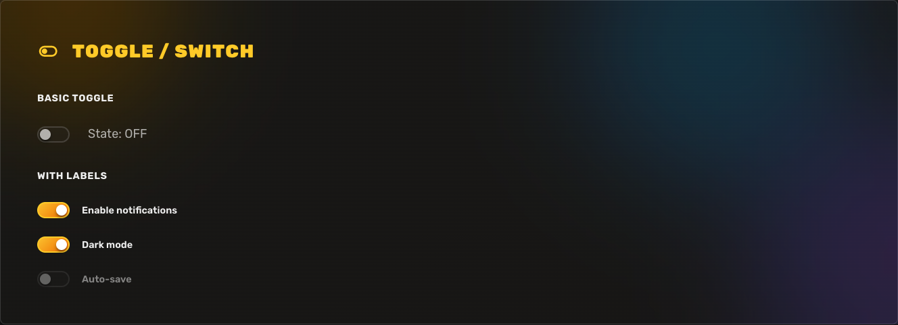

Toggle switch component with label support.

```vue
<script setup>
import { ref } from 'vue'
import { Toggle } from '@aresrpg/ui'

const enabled = ref(false)
const darkMode = ref(true)
</script>

<template>
  <!-- Basic toggle -->
  <Toggle v-model="enabled" />

  <!-- With label -->
  <Toggle v-model="darkMode" label="Dark mode" />

  <!-- Disabled -->
  <Toggle v-model="enabled" label="Auto-save" :disabled="true" />
</template>
```

**Props:**
- `modelValue`: boolean - v-model binding
- `label`: string - Toggle label
- `disabled`: boolean (default: false)

**Events:**
- `@update:modelValue`: Emitted when toggle state changes

---

### Tabs

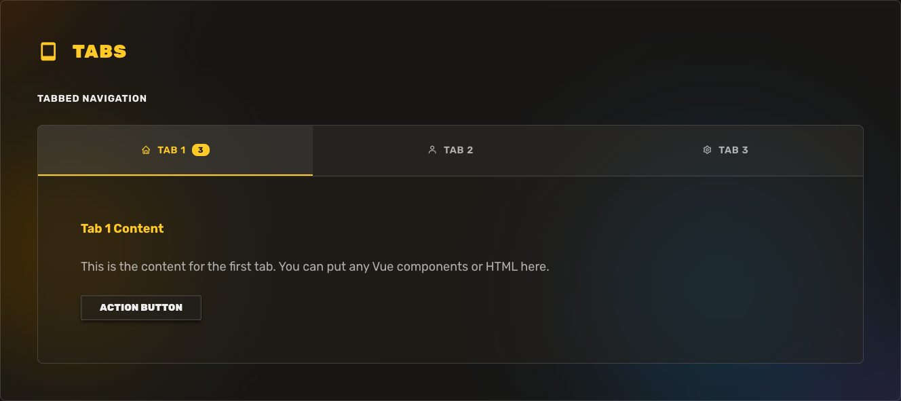

Tab navigation component with icon and badge support.

```vue
<script setup>
import { ref } from 'vue'
import { Tabs, Button } from '@aresrpg/ui'

const activeTab = ref(0)

const tabs = [
  { label: 'Tab 1', icon: 'bx bx-home', badge: '3' },
  { label: 'Tab 2', icon: 'bx bx-user' },
  { label: 'Tab 3', icon: 'bx bx-cog' }
]
</script>

<template>
  <Tabs v-model="activeTab" :tabs="tabs">
    <template #tab-0>
      <h4>Tab 1 Content</h4>
      <p>Content for the first tab</p>
      <Button>Action Button</Button>
    </template>

    <template #tab-1>
      <p>Content for tab 2</p>
    </template>

    <template #tab-2>
      <p>Content for tab 3</p>
    </template>
  </Tabs>
</template>
```

**Props:**
- `modelValue`: number - v-model for active tab index
- `tabs`: Array<{ label: string, icon?: string, badge?: string }> - Tab configuration

**Events:**
- `@update:modelValue`: Emitted when active tab changes

---

### Tooltip

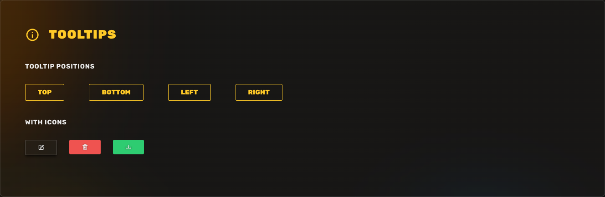

Hover tooltips with customizable positioning.

```vue
<script setup>
import { Tooltip, Button } from '@aresrpg/ui'
</script>

<template>
  <Tooltip content="Tooltip text" position="top">
    <Button>Top</Button>
  </Tooltip>

  <Tooltip content="Tooltip text" position="bottom">
    <Button>Bottom</Button>
  </Tooltip>

  <Tooltip content="Tooltip text" position="left">
    <Button>Left</Button>
  </Tooltip>

  <Tooltip content="Tooltip text" position="right">
    <Button>Right</Button>
  </Tooltip>
</template>
```

**Props:**
- `content`: string - Tooltip content
- `position`: 'top' | 'bottom' | 'left' | 'right' (default: 'top')

---

### Avatar

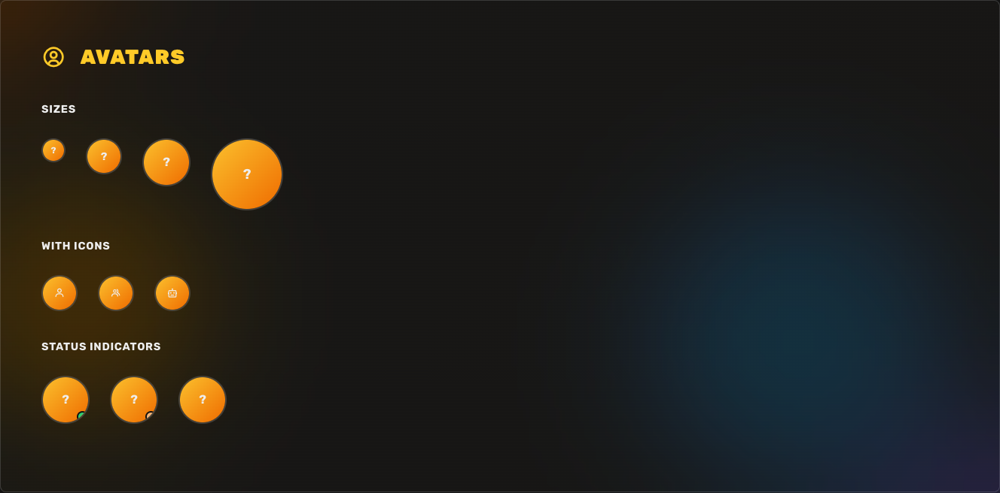

User avatar with size variants and status indicators.

```vue
<script setup>
import { Avatar } from '@aresrpg/ui'
</script>

<template>
  <!-- Sizes -->
  <Avatar size="sm" src="avatar.jpg" alt="User" />
  <Avatar size="md" src="avatar.jpg" alt="User" />
  <Avatar size="lg" src="avatar.jpg" alt="User" />
  <Avatar size="xl" src="avatar.jpg" alt="User" />

  <!-- With icons (when no src) -->
  <Avatar icon="bx bx-user" />

  <!-- With status indicators -->
  <Avatar src="avatar.jpg" status="online" />
  <Avatar src="avatar.jpg" status="away" />
  <Avatar src="avatar.jpg" status="busy" />
</template>
```

**Props:**
- `src`: string - Avatar image URL
- `alt`: string - Alt text for image
- `size`: 'sm' | 'md' | 'lg' | 'xl' (default: 'md')
- `icon`: string - Icon class (when no src provided)
- `status`: 'online' | 'away' | 'busy' - Status indicator

---

### Dropdown

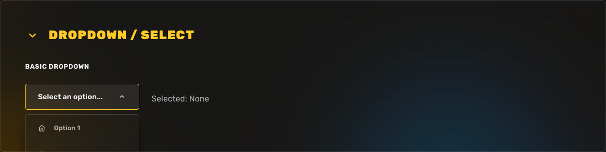

Dropdown menu with icons and animations.

```vue
<script setup>
import { ref } from 'vue'
import { Dropdown } from '@aresrpg/ui'

const selected = ref(null)

const options = [
  { value: 'option1', label: 'Option 1', icon: 'bx bx-home' },
  { value: 'option2', label: 'Option 2', icon: 'bx bx-user' },
  { value: 'option3', label: 'Option 3', icon: 'bx bx-cog' },
  { value: 'option4', label: 'Option 4', icon: 'bx bx-bell' }
]
</script>

<template>
  <Dropdown
    v-model="selected"
    :options="options"
    placeholder="Select an option..."
  />
</template>
```

**Props:**
- `modelValue`: any - v-model binding for selected value
- `options`: Array<{ value: any, label: string, icon?: string }> - Dropdown options
- `placeholder`: string - Placeholder text

**Events:**
- `@update:modelValue`: Emitted when selection changes

---

### Navbar

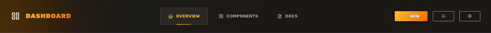

Responsive navigation bar with glassmorphism.

```vue
<script setup>
import { Navbar } from '@aresrpg/ui'

const navItems = [
  { label: 'Overview', icon: 'bx bx-home', href: '#' },
  { label: 'Components', icon: 'bx bx-grid', href: '#' },
  { label: 'Docs', icon: 'bx bx-book', href: '#' }
]
</script>

<template>
  <Navbar brand="Dashboard" :items="navItems">
    <template #actions>
      <Button size="sm" variant="gradient">New</Button>
      <Button size="sm" variant="outline" aria-label="Notifications">
        <i class="bx bx-bell"></i>
      </Button>
    </template>
  </Navbar>
</template>
```

**Props:**
- `brand`: string - Brand name or logo text
- `items`: Array<{ label: string, icon?: string, href: string }> - Navigation items

**Slots:**
- `brand`: Custom brand content
- `actions`: Action buttons in navbar

---

### Sidebar

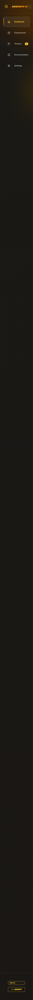

Collapsible sidebar navigation with glassmorphism.

```vue
<script setup>
import { ref } from 'vue'
import { Sidebar } from '@aresrpg/ui'

const collapsed = ref(false)

const menuItems = [
  { label: 'Dashboard', icon: 'bx bx-home', badge: null },
  { label: 'Components', icon: 'bx bx-grid', badge: '14' },
  { label: 'Themes', icon: 'bx bx-palette', badge: '5' },
  { label: 'Documentation', icon: 'bx bx-book' },
  { label: 'Settings', icon: 'bx bx-cog' }
]
</script>

<template>
  <Sidebar
    v-model:collapsed="collapsed"
    brand="AresRPG UI"
    :items="menuItems"
  >
    <template #footer>
      <div class="version">v0.1.0</div>
      <Button variant="outline" size="sm">
        <i class="bx bx-log-out"></i>
        Logout
      </Button>
    </template>
  </Sidebar>
</template>
```

**Props:**
- `collapsed`: boolean - v-model for collapsed state
- `brand`: string - Brand name
- `items`: Array<{ label: string, icon: string, badge?: string }> - Menu items

**Slots:**
- `brand`: Custom brand content
- `footer`: Footer content

---

### Skeleton

Skeleton loader component for loading states.

```vue
<script setup>
import { Skeleton } from '@aresrpg/ui'
</script>

<template>
  <!-- Text skeleton -->
  <Skeleton variant="text" width="200px" />

  <!-- Circle skeleton (for avatars) -->
  <Skeleton variant="circle" width="40px" height="40px" />

  <!-- Rectangle skeleton -->
  <Skeleton variant="rectangle" width="100%" height="100px" />

  <!-- Card skeleton -->
  <Skeleton variant="card" width="300px" height="200px" />

  <!-- Disable animation -->
  <Skeleton variant="text" :animated="false" />
</template>
```

**Props:**
- `variant`: 'text' | 'circle' | 'rectangle' | 'card' (default: 'text')
- `width`: string | number - Width in px or % (default: '100%')
- `height`: string | number - Height in px or % (default: auto based on variant)
- `animated`: boolean (default: true) - Enable shimmer animation

---

### EmptyState

Empty state component for no-data scenarios.

```vue
<script setup>
import { EmptyState, Button } from '@aresrpg/ui'
</script>

<template>
  <!-- Basic empty state -->
  <EmptyState
    icon="bx bx-inbox"
    title="No data"
    message="There is nothing to display here."
  />

  <!-- With custom action -->
  <EmptyState
    icon="bx bx-search"
    title="No results found"
    message="Try adjusting your search or filter criteria."
  >
    <template #action>
      <Button variant="gradient">Clear Filters</Button>
    </template>
  </EmptyState>

  <!-- Custom content with slots -->
  <EmptyState>
    <template #title>
      <h3>Custom Title</h3>
    </template>
    <template #message>
      <p>Custom message content</p>
    </template>
    <template #action>
      <Button>Take Action</Button>
    </template>
  </EmptyState>
</template>
```

**Props:**
- `icon`: string (default: 'bx bx-inbox') - Icon class
- `title`: string (default: 'No data') - Title text
- `message`: string (default: 'There is nothing to display here.') - Message text

**Slots:**
- `title`: Custom title content
- `message`: Custom message content
- `action`: Action button or custom content

---

### ChatMessage

Individual chat message component with avatar, message bubble, and timestamp.

```vue
<script setup>
import { ChatMessage } from '@aresrpg/ui'
</script>

<template>
  <!-- Incoming message -->
  <ChatMessage
    message="Hey! How are you doing?"
    sender-name="Alice"
    avatar-icon="bx bx-user"
    :is-own="false"
    :timestamp="new Date()"
    status="online"
    :show-status="true"
  />

  <!-- Own message (aligned right) -->
  <ChatMessage
    message="I'm doing great, thanks!"
    sender-name="You"
    avatar-icon="bx bx-user-circle"
    :is-own="true"
    :timestamp="new Date()"
  />

  <!-- With avatar image -->
  <ChatMessage
    message="Check out this feature!"
    sender-name="Bob"
    avatar-src="https://example.com/avatar.jpg"
    :is-own="false"
    :timestamp="new Date()"
  />
</template>
```

**Props:**
- `message`: string (required) - Message text content
- `senderName`: string (default: 'Unknown') - Name of the sender
- `avatarSrc`: string - Avatar image URL
- `avatarIcon`: string (default: 'bx bx-user') - Icon class for avatar (if no src)
- `isOwn`: boolean (default: false) - Whether this message is from the current user
- `timestamp`: string | Date | number (default: new Date()) - Message timestamp
- `status`: 'online' | 'offline' | '' - Online status indicator
- `showStatus`: boolean (default: false) - Whether to show status indicator

---

### ChatMessageList

Scrollable chat message list container with auto-scroll functionality.

```vue
<script setup>
import { ref } from 'vue'
import { ChatMessageList } from '@aresrpg/ui'

const messages = ref([
  {
    id: 1,
    message: 'Welcome to the chat!',
    senderName: 'System',
    avatarIcon: 'bx bx-bot',
    isOwn: false,
    timestamp: new Date(Date.now() - 3600000)
  },
  {
    id: 2,
    message: 'Thanks! Great to be here.',
    senderName: 'You',
    avatarIcon: 'bx bx-user-circle',
    isOwn: true,
    timestamp: new Date()
  }
])
</script>

<template>
  <div style="height: 500px;">
    <ChatMessageList
      :messages="messages"
      :auto-scroll="true"
      empty-state-text="No messages yet. Start chatting!"
      :scroll-threshold="150"
    />
  </div>
</template>
```

**Props:**
- `messages`: Array (default: []) - Array of message objects
  - Each message object should have: `id`, `message`, `senderName`, `avatarSrc`, `avatarIcon`, `isOwn`, `timestamp`, `status`, `showStatus`
- `autoScroll`: boolean (default: true) - Auto-scroll to bottom on new messages
- `emptyStateText`: string (default: 'No messages yet. Start the conversation!') - Text shown when no messages
- `scrollThreshold`: number (default: 150) - Distance from bottom to hide scroll button (px)

**Features:**
- Auto-scrolls to bottom when new messages arrive
- Shows "scroll to bottom" button when not at bottom
- Smooth scrolling animations
- Custom scrollbar styling
- Empty state with icon

---

### ChatInput

Chat input component with send button and Enter-to-send functionality.

```vue
<script setup>
import { ref } from 'vue'
import { ChatInput } from '@aresrpg/ui'

const message = ref('')

function handleSendMessage(messageText) {
  console.log('Sending:', messageText)
  // Add your send logic here
  message.value = '' // Clear input after sending
}
</script>

<template>
  <ChatInput
    v-model="message"
    placeholder="Type a message..."
    :max-length="500"
    :show-char-count="true"
    :auto-resize="true"
    :max-rows="5"
    @send="handleSendMessage"
  />
</template>
```

**Props:**
- `modelValue`: string - v-model binding for input text
- `placeholder`: string (default: 'Type a message...') - Placeholder text
- `disabled`: boolean (default: false) - Disabled state
- `maxLength`: number - Maximum character length
- `showCharCount`: boolean (default: false) - Show character counter
- `rows`: number (default: 1) - Initial number of rows (min height)
- `autoResize`: boolean (default: true) - Auto-resize textarea based on content
- `maxRows`: number (default: 5) - Maximum rows before scrolling

**Events:**
- `@send`: Emitted when user sends message (Enter key or send button)
- `@update:modelValue`: Emitted when input value changes
- `@focus`: Emitted when input gains focus
- `@blur`: Emitted when input loses focus

**Keyboard Shortcuts:**
- `Enter`: Send message
- `Shift + Enter`: New line (doesn't send)

**Methods:**
- `focus()`: Focus the input (accessible via ref)

---

## 🛠️ Composables

### useTheme()

Composable for theme management.

```js
const {
  currentTheme,    // Ref<string> - Current active theme
  themes,          // string[] - All available themes
  setTheme,        // (theme: string) => void - Set theme
  getTheme,        // () => string - Get current theme
  toggleTheme,     // () => void - Toggle to next theme
  initTheme        // () => void - Initialize theme from localStorage
} = useTheme()
```

## 🎨 Customization

### CSS Variables

All themes use CSS variables that you can override:

```css
[data-theme="dark"] {
  --color-accent-primary: #your-color;
  --glass-bg: rgba(30, 30, 30, 0.25);
  /* ... other variables */
}
```

### Creating Custom Themes

Add a new theme by defining CSS variables:

```css
[data-theme="custom"] {
  --color-bg-primary: #your-bg;
  --color-text-primary: #your-text;
  --color-accent-primary: #your-accent;
  --gradient-primary: linear-gradient(135deg, #start, #end);
  /* ... define all required variables */
}
```

Then add your theme to the themes array in `useTheme()`.

## 🔧 Development

```bash
# Install dependencies
npm install

# Start dev server with demo app
npm run dev

# Build library
npm run build

# Preview demo
npm run preview
```

## 🌐 Browser Support

- Chrome/Edge (latest)
- Firefox (latest)
- Safari 15.4+ (backdrop-filter support)

## 📄 License

MIT © [AresRPG](https://github.com/aresrpg)

## 🤝 Contributing

Contributions are welcome! Feel free to open issues or submit pull requests.

## 🔗 Links

- [GitHub Repository](https://github.com/aresrpg/aresrpg-ui)
- [npm Package](https://www.npmjs.com/package/@aresrpg/ui)
