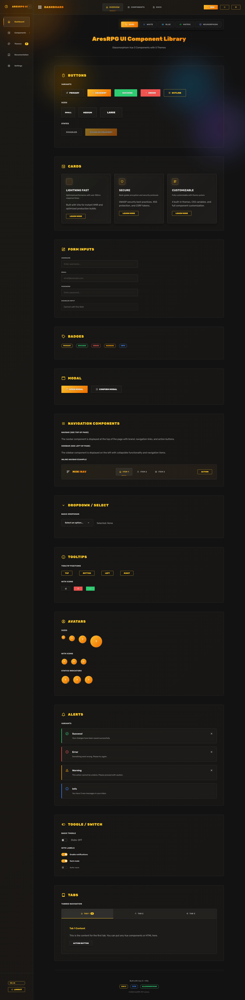
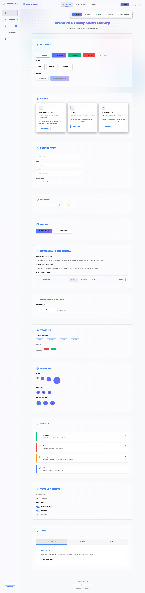
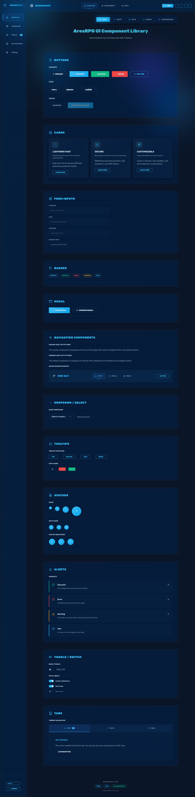
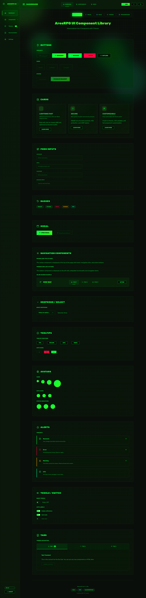
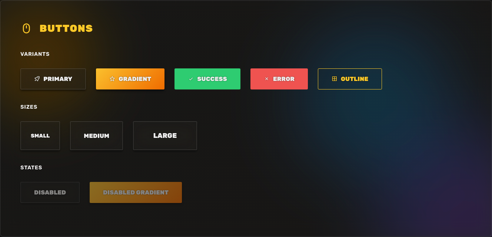
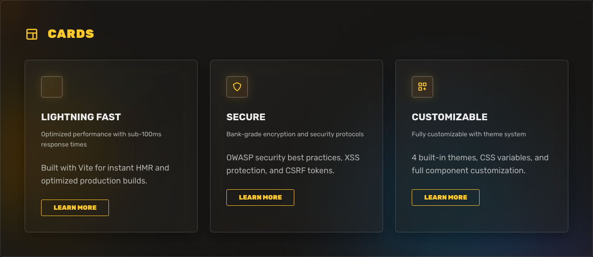
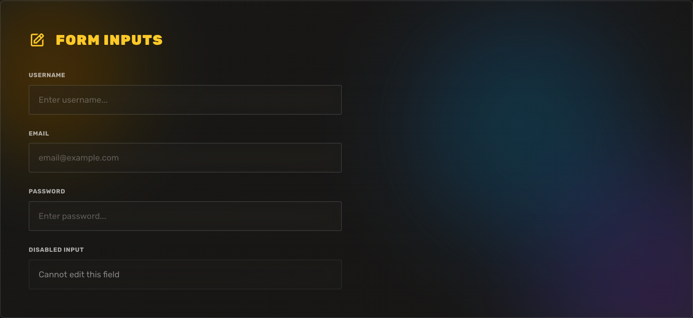

<h1 align=center>@aresrpg/ui</h1>

<p align=center>
  
  
  
  
</p>

<p align=center>Glassmorphism Vue 3 component library for modern gaming UIs</p>

<p align=center>
  
</p>

---

A beautiful, theme-switchable Vue 3 component library featuring glassmorphism effects, animated gradient backgrounds, and a gaming-focused design aesthetic.

## ✨ Features

- 🎨 **4 Built-in Themes**: Dark (default), White, Blue, Matrix
- 💎 **True Glassmorphism**: Animated gradient mesh backgrounds with backdrop blur
- ⚡ **Vue 3 + Vite**: Fast, modern, tree-shakeable
- 🎮 **Gaming Aesthetic**: MMORPG-inspired design with angular borders and bold typography
- 📦 **Zero Dependencies**: Only requires Vue 3 as peer dependency
- 🎯 **TypeScript Ready**: Full JSDoc annotations
- 🌐 **SSR Compatible**: Works with Nuxt and other SSR frameworks

## 🎨 Themes Showcase

<table>
  <tr>
    <td width="50%">
      <p align="center"><strong>Dark Theme</strong></p>
      
    </td>
    <td width="50%">
      <p align="center"><strong>White Theme</strong></p>
      
    </td>
  </tr>
  <tr>
    <td width="50%">
      <p align="center"><strong>Blue Theme</strong></p>
      
    </td>
    <td width="50%">
      <p align="center"><strong>Matrix Theme</strong></p>
      
    </td>
  </tr>
</table>

## 📦 Installation

```bash
npm install @aresrpg/ui
```

## 🚀 Quick Start

### Global Registration

```js
// main.js
import { createApp } from 'vue'
import AresRPGUI from '@aresrpg/ui'
import '@aresrpg/ui/style.css'
import App from './App.vue'

const app = createApp(App)
app.use(AresRPGUI)
app.mount('#app')
```

Now all components are available with `Ares` prefix:

```vue
<template>
  <AresButton variant="gradient">Click me</AresButton>
  <AresCard title="Hello World" />
</template>
```

### Import on Demand

```vue
<script setup>
import { Button, Card, ThemeSwitcher } from '@aresrpg/ui'
import '@aresrpg/ui/style.css'
</script>

<template>
  <div>
    <ThemeSwitcher />
    <Button variant="gradient">Click me</Button>
    <Card title="Hello World" />
  </div>
</template>
```

## 🎨 Theme System

### Available Themes

- **dark** (default): Gold/Orange accents, MMORPG gaming aesthetic
- **white**: Clean professional look with Blue/Purple accents
- **blue**: Ocean/Cyberpunk theme with Cyan accents
- **matrix**: Terminal/Hacker theme with Green accents

### Using Themes

#### With ThemeSwitcher Component

```vue
<script setup>
import { ThemeSwitcher } from '@aresrpg/ui'
</script>

<template>
  <ThemeSwitcher />
</template>
```

#### With useTheme Composable

```vue
<script setup>
import { useTheme } from '@aresrpg/ui'

const { currentTheme, setTheme, toggleTheme, themes } = useTheme()

// Set specific theme
setTheme('matrix')

// Toggle through themes
toggleTheme()

// Get current theme
console.log(currentTheme.value) // 'matrix'

// Get all available themes
console.log(themes) // ['dark', 'white', 'blue', 'matrix']
</script>
```

## 📚 Components

### Component Previews

<table>
  <tr>
    <td width="33%">
      <p align="center"><strong>Buttons</strong></p>
      
    </td>
    <td width="33%">
      <p align="center"><strong>Cards</strong></p>
      
    </td>
    <td width="33%">
      <p align="center"><strong>Inputs</strong></p>
      
    </td>
  </tr>
</table>

### Button

Glassmorphism button with multiple variants and sizes.

```vue
<Button variant="primary">Primary</Button>
<Button variant="gradient">Gradient</Button>
<Button variant="success">Success</Button>
<Button variant="error">Error</Button>
<Button variant="outline">Outline</Button>

<Button size="sm">Small</Button>
<Button size="md">Medium</Button>
<Button size="lg">Large</Button>

<Button :disabled="true">Disabled</Button>
```

**Props:**
- `variant`: 'primary' | 'gradient' | 'success' | 'error' | 'outline' (default: 'primary')
- `size`: 'sm' | 'md' | 'lg' (default: 'md')
- `disabled`: boolean (default: false)

**Events:**
- `@click`: Emitted when button is clicked

### Card

Glassmorphism card with header, icon, and footer slots.

```vue
<Card
  title="Card Title"
  description="Card description"
  icon="bx bx-star"
  :hoverable="true"
>
  <p>Card content goes here</p>

  <template #footer>
    <Button size="sm">Action</Button>
  </template>
</Card>
```

**Props:**
- `title`: string - Card title
- `description`: string - Card description
- `icon`: string - Icon class (e.g., 'bx bx-star')
- `hoverable`: boolean (default: true) - Enable hover effect

**Slots:**
- `default`: Card content
- `icon`: Custom icon content
- `title`: Custom title content
- `description`: Custom description content
- `header`: Full custom header
- `footer`: Footer content

### Modal

Glassmorphism modal with backdrop blur.

```vue
<script setup>
import { ref } from 'vue'
const showModal = ref(false)
</script>

<template>
  <Button @click="showModal = true">Open Modal</Button>

  <Modal
    v-model="showModal"
    title="Modal Title"
    :closable="true"
    :close-on-overlay="true"
  >
    <p>Modal content</p>

    <template #footer>
      <Button @click="showModal = false">Cancel</Button>
      <Button variant="gradient" @click="showModal = false">Confirm</Button>
    </template>
  </Modal>
</template>
```

**Props:**
- `modelValue`: boolean (required) - v-model binding for visibility
- `title`: string - Modal title
- `closable`: boolean (default: true) - Show close button
- `closeOnOverlay`: boolean (default: true) - Close when clicking overlay

**Events:**
- `@update:modelValue`: Emitted when modal visibility changes
- `@close`: Emitted when modal is closed

**Slots:**
- `default`: Modal content
- `header`: Custom header content
- `footer`: Footer content

### Input

Glassmorphism text input.

```vue
<script setup>
import { ref } from 'vue'
const username = ref('')
</script>

<template>
  <Input
    v-model="username"
    type="text"
    label="Username"
    placeholder="Enter username..."
    :disabled="false"
  />
</template>
```

**Props:**
- `modelValue`: string | number - v-model binding
- `type`: 'text' | 'email' | 'password' | 'number' (default: 'text')
- `label`: string - Input label
- `placeholder`: string - Placeholder text
- `disabled`: boolean (default: false)

**Events:**
- `@update:modelValue`: Emitted when input value changes
- `@focus`: Emitted when input gains focus
- `@blur`: Emitted when input loses focus

### Badge

Status badge with color variants.

```vue
<Badge variant="primary">Primary</Badge>
<Badge variant="success">Success</Badge>
<Badge variant="error">Error</Badge>
<Badge variant="warning">Warning</Badge>
<Badge variant="info">Info</Badge>
```

**Props:**
- `variant`: 'primary' | 'success' | 'error' | 'warning' | 'info' (default: 'primary')

### ThemeSwitcher

Theme switcher component with all available themes.

```vue
<ThemeSwitcher />
```

Shows buttons for all available themes (dark, white, blue, matrix) with icons and labels.

### Additional Components

- **Navbar**: Responsive navigation bar with glassmorphism
- **Sidebar**: Collapsible sidebar navigation
- **Dropdown**: Dropdown menu with animations
- **Tooltip**: Hover tooltips with customizable positioning
- **Avatar**: User avatar with size variants
- **Alert**: Alert messages with variants
- **Toggle**: Toggle switch component
- **Tabs**: Tab navigation component

## 🛠️ Composables

### useTheme()

Composable for theme management.

```js
const {
  currentTheme,    // Ref<string> - Current active theme
  themes,          // string[] - All available themes
  setTheme,        // (theme: string) => void - Set theme
  getTheme,        // () => string - Get current theme
  toggleTheme,     // () => void - Toggle to next theme
  initTheme        // () => void - Initialize theme from localStorage
} = useTheme()
```

## 🎨 Customization

### CSS Variables

All themes use CSS variables that you can override:

```css
[data-theme="dark"] {
  --color-accent-primary: #your-color;
  --glass-bg: rgba(30, 30, 30, 0.25);
  /* ... other variables */
}
```

### Creating Custom Themes

Add a new theme by defining CSS variables:

```css
[data-theme="custom"] {
  --color-bg-primary: #your-bg;
  --color-text-primary: #your-text;
  --color-accent-primary: #your-accent;
  --gradient-primary: linear-gradient(135deg, #start, #end);
  /* ... define all required variables */
}
```

Then add your theme to the themes array in `useTheme()`.

## 🔧 Development

```bash
# Install dependencies
npm install

# Start dev server with demo app
npm run dev

# Build library
npm run build

# Preview demo
npm run preview
```

## 🌐 Browser Support

- Chrome/Edge (latest)
- Firefox (latest)
- Safari 15.4+ (backdrop-filter support)

## 📄 License

MIT © [AresRPG](https://github.com/aresrpg)

## 🤝 Contributing

Contributions are welcome! Feel free to open issues or submit pull requests.

## 🔗 Links

- [GitHub Repository](https://github.com/aresrpg/aresrpg-ui)
- [npm Package](https://www.npmjs.com/package/@aresrpg/ui)
- [AresRPG Main Project](https://github.com/aresrpg/aresrpg)
